# FLC Compensation Analysis - Project Roadmap v1

## Executive Summary
AI-powered compensation analysis system enabling the committee to perform scenario analysis, peer benchmarking, and market comparisons for FLC salary structures.

---

## High-Level Architecture

```mermaid
flowchart TB
    subgraph INPUTS["📥 DATA INPUTS"]
        direction TB
        FLC["🏫 FLC Data<br/>(Workday exports)"]
        PEER["🎓 Peer Institutions<br/>(IPEDS, CUPA-HR)"]
        BLS["📊 BLS/Market Data<br/>(Occupational stats)"]
        COMP["🏢 Competitor Data<br/>(Regional institutions)"]
    end

    subgraph PHASE1["⚙️ PHASE 1: Model Design & Architecture"]
        direction TB
        P1A["System Architecture"]
        P1B["Interface Design<br/>(Web/Menu-driven)"]
        P1C["Dashboard Specs"]
        P1D["Training Materials"]
    end

    subgraph PHASE2["🔧 PHASE 2: Data Preparation"]
        direction TB
        P2A["Data Ingestion<br/>& Validation"]
        P2B["Cleaning &<br/>Normalization"]
        P2C["Schema Mapping<br/>& Standardization"]
        P2D["Quality Assurance<br/>& Documentation"]
    end

    subgraph PHASE3["📈 PHASE 3: Analysis & Product Development"]
        direction TB
        P3A["Scenario Analysis"]
        P3B["Footprint Analysis"]
        P3C["Competitor Analysis"]
        P3D["Ad-hoc Requests<br/>via AI Model"]
    end

    subgraph OUTPUTS["📤 DELIVERABLES"]
        direction TB
        OUT1["📊 Interactive Dashboards"]
        OUT2["📋 Analysis Reports"]
        OUT3["💡 Committee Recommendations"]
        OUT4["🔄 Ongoing Support"]
    end

    INPUTS --> PHASE1
    PHASE1 --> PHASE2
    INPUTS --> PHASE2
    PHASE2 --> PHASE3
    PHASE3 --> OUTPUTS

    style INPUTS fill:#e1f5fe,stroke:#01579b
    style PHASE1 fill:#fff3e0,stroke:#e65100
    style PHASE2 fill:#f3e5f5,stroke:#7b1fa2
    style PHASE3 fill:#e8f5e9,stroke:#2e7d32
    style OUTPUTS fill:#fce4ec,stroke:#c2185b
```



---

## Phase Details

### 📐 PHASE 1: Model Design & Architecture
**Objective:** Design the system before building it

| Component | Description | Deliverable |
|-----------|-------------|-------------|
| System Architecture | Technical design for data flow, storage, processing | Architecture document |
| Interface Design | Interactive UI for committee (web-based or CLI menu) | Wireframes/mockups |
| Dashboard Specs | Layout and metrics for visualization | Dashboard design doc |
| Training Materials | How-to guides for committee members | Training deck/docs |

**Inputs Required:**
- Committee member list and roles
- Key questions the analysis must answer
- Preferred interaction style (web vs. menu-driven)
- Existing systems to integrate with

**Exit Criteria:**
- [ ] Architecture approved by stakeholders
- [ ] Interface design signed off
- [ ] Dashboard metrics defined
- [ ] Training outline complete

---

### 🔧 PHASE 2: Data Preparation
**Objective:** Transform raw files into analysis-ready datasets

| Component | Description | Deliverable |
|-----------|-------------|-------------|
| Data Ingestion | Accept files in various formats (CSV, Excel, etc.) | Ingestion pipeline |
| Cleaning & Normalization | Handle missing values, outliers, inconsistencies | Clean datasets |
| Schema Mapping | Standardize job titles, classifications, pay bands | Data dictionary |
| Quality Assurance | Validate data accuracy and completeness | QA report |

**Inputs Required:**
- FLC salary/position data (Workday exports)
- Peer institution data (IPEDS, CUPA-HR, state systems)
- BLS occupational wage data
- Regional competitor salary benchmarks

**Exit Criteria:**
- [ ] All data sources ingested
- [ ] Data dictionary complete
- [ ] QA validation passed
- [ ] Datasets ready for analysis

---

### 📈 PHASE 3: Analysis & Product Development
**Objective:** Deliver insights and respond to committee needs

| Component | Description | Deliverable |
|-----------|-------------|-------------|
| Scenario Analysis | "What-if" modeling for salary adjustments | Scenario reports |
| Footprint Analysis | Position distribution, grade analysis | Footprint visualizations |
| Competitor Analysis | FLC vs. peer/market positioning | Competitive benchmarks |
| Ad-hoc Support | AI-powered responses to committee questions | On-demand analysis |

**Inputs Required:**
- Clean datasets from Phase 2
- Committee questions and priorities
- Scenario parameters (budget constraints, % increases, etc.)

**Exit Criteria:**
- [ ] Core analyses complete
- [ ] Dashboards operational
- [ ] Committee trained on system use
- [ ] Support model in place

---

## Data Flow Diagram

```
┌─────────────────────────────────────────────────────────────────────────────┐
│                         FLC COMPENSATION ANALYSIS SYSTEM                     │
├─────────────────────────────────────────────────────────────────────────────┤
│                                                                              │
│   ┌──────────────┐    ┌──────────────┐    ┌──────────────┐                 │
│   │  RAW DATA    │    │  PROCESSING  │    │   OUTPUTS    │                 │
│   │              │    │              │    │              │                 │
│   │ • FLC Workday│───▶│ • Validate   │───▶│ • Dashboards │                 │
│   │ • IPEDS      │    │ • Clean      │    │ • Reports    │                 │
│   │ • CUPA-HR    │    │ • Normalize  │    │ • Scenarios  │                 │
│   │ • BLS Data   │    │ • Map Schema │    │ • Insights   │                 │
│   │ • Competitors│    │ • QA Check   │    │              │                 │
│   └──────────────┘    └──────────────┘    └──────────────┘                 │
│          │                   │                   │                          │
│          ▼                   ▼                   ▼                          │
│   ┌──────────────────────────────────────────────────────┐                 │
│   │              AI MODEL (Claude Code)                   │                 │
│   │  • Natural language queries                          │                 │
│   │  • Automated analysis generation                     │                 │
│   │  • Scenario modeling                                 │                 │
│   │  • Report generation                                 │                 │
│   └──────────────────────────────────────────────────────┘                 │
│                              │                                              │
│                              ▼                                              │
│                    ┌──────────────────┐                                    │
│                    │    COMMITTEE     │                                    │
│                    │   INTERFACE      │                                    │
│                    │  (Web/Menu UI)   │                                    │
│                    └──────────────────┘                                    │
│                                                                              │
└─────────────────────────────────────────────────────────────────────────────┘
```

---

## Critical Questions to Clarify

### For Mario / Leadership:
1. **Who is on the committee?** Names, roles, technical comfort level
2. **What decisions will this inform?** Salary adjustments? New positions? Budget planning?
3. **Timeline expectations?** When does committee need first results?
4. **Budget constraints?** Any parameters for scenario modeling?

### For Data Sourcing:
5. **What FLC data is available?** Workday export format, fields, refresh frequency
6. **Peer institutions list?** Which schools are we comparing to?
7. **Access to CUPA-HR?** Does FLC have a subscription?
8. **Historical data?** How many years back for trend analysis?

### For Technical Implementation:
9. **Hosting preference?** Local vs. cloud for sensitive salary data
10. **Access control?** Who can see what data?
11. **Integration needs?** Connect to existing FLC systems?

---

## Recommended Additions to Mario's Framework

| Addition | Rationale |
|----------|-----------|
| **Phase 0: Discovery** | Gather requirements, define success metrics before designing |
| **Data Governance** | Sensitive salary data needs clear access policies |
| **Iteration Cycles** | Build in feedback loops, not just linear phases |
| **Success Metrics** | How do we measure if this worked? |

---

## Technology Stack (Proposed)

| Layer | Technology | Purpose |
|-------|------------|---------|
| Data Storage | DuckDB / SQLite | Local, fast, no server needed |
| Processing | Python + Pandas | Data cleaning, transformation |
| AI Layer | Claude Code | Natural language queries, analysis |
| Interface | Streamlit or CLI | Interactive access for committee |
| Visualization | Plotly / Altair | Dashboards and charts |
| Version Control | Git | Track changes, collaboration |

---

## Next Steps

1. **Review this roadmap** with Mario
2. **Clarify open questions** (committee, data sources, timeline)
3. **Scope Phase 1** more precisely once requirements clear
4. **Begin architecture document** 

---

*Document Version: 1.0*  
*Created: 2026-01-29*  
*Author: Winn Cook / Donny (AI)*
