```mermaid
flowchart LR
    subgraph P1["PHASE 1<br/>Design & Architecture"]
        direction TB
        P1A["✓ System Design"]
        P1B["✓ Interface Specs"]
        P1C["✓ Dashboard Layout"]
        P1D["Training Materials"]
    end

    subgraph INPUTS["DATA INPUTS"]
        direction TB
        I1["🏫 FLC Internal<br/>HR/Payroll • Finance"]
        I2["🎓 CUPA-HR<br/>Faculty/Staff Benchmarks"]
        I3["📊 IPEDS<br/>27 Peer Institutions"]
        I4["💰 BLS OEWS<br/>Regional Wages"]
        I5["🏠 BEA/MIT<br/>Cost of Living"]
    end

    subgraph P2["PHASE 2<br/>Data Preparation"]
        direction TB
        P2A["Ingest & Validate"]
        P2B["Clean & Normalize"]
        P2C["FERPA Compliance<br/>(N≥5 suppression)"]
        P2D["Schema Mapping"]
    end

    subgraph P3["PHASE 3<br/>Analysis & Delivery"]
        direction TB
        P3A["Market Benchmarking<br/>(vs 27 peers)"]
        P3B["Geographic Adjustment<br/>(Durango COL)"]
        P3C["Equity Analysis<br/>(regression model)"]
        P3D["Compression Detection<br/>(rank ratios)"]
    end

    subgraph OUTPUTS["DELIVERABLES"]
        direction TB
        O1["📊 Executive Dashboard"]
        O2["📋 Scenario Reports"]
        O3["🔍 Footprint Analysis"]
        O4["⚖️ Equity Findings"]
        O5["💬 AI Query Support"]
    end

    P1 --> INPUTS
    INPUTS --> P2
    P2 --> P3
    P3 --> OUTPUTS

    style P1 fill:#e3f2fd,stroke:#1565c0,stroke-width:2px
    style INPUTS fill:#fff8e1,stroke:#f9a825,stroke-width:2px
    style P2 fill:#f3e5f5,stroke:#7b1fa2,stroke-width:2px
    style P3 fill:#e8f5e9,stroke:#2e7d32,stroke-width:2px
    style OUTPUTS fill:#fce4ec,stroke:#c2185b,stroke-width:2px
```

# FLC Compensation Analysis System
## Unified Project Architecture

---



---

## Simplified Data Flow

```
┌─────────────────────────────────────────────────────────────────────────────────┐
│                    FLC COMPENSATION ANALYSIS SYSTEM (CSAS)                       │
│                                                                                  │
│   ╔═══════════════╗    ╔═══════════════╗    ╔═══════════════╗    ╔═══════════╗ │
│   ║   PHASE 1     ║    ║   PHASE 2     ║    ║   PHASE 3     ║    ║  OUTPUTS  ║ │
│   ║   DESIGN      ║    ║   DATA PREP   ║    ║   ANALYSIS    ║    ║           ║ │
│   ╠═══════════════╣    ╠═══════════════╣    ╠═══════════════╣    ╠═══════════╣ │
│   ║ • Architecture║    ║ • Ingest      ║    ║ • Market      ║    ║ Dashboard ║ │
│   ║ • Interface   ║───▶║ • Clean       ║───▶║   Benchmark   ║───▶║ Reports   ║ │
│   ║ • Dashboard   ║    ║ • FERPA check ║    ║ • Equity      ║    ║ Scenarios ║ │
│   ║ • Training    ║    ║ • Standardize ║    ║ • Compression ║    ║ AI Query  ║ │
│   ╚═══════════════╝    ╚═══════════════╝    ╚═══════════════╝    ╚═══════════╝ │
│         │                     ▲                                                  │
│         │                     │                                                  │
│         │              ┌──────┴──────┐                                          │
│         │              │ DATA INPUTS │                                          │
│         │              ├─────────────┤                                          │
│         └─────────────▶│ FLC Workday │ (RESTRICTED)                             │
│                        │ CUPA-HR     │ (Subscription)                           │
│                        │ IPEDS       │ (Public - 27 peers)                      │
│                        │ BLS/BEA     │ (Public)                                 │
│                        └─────────────┘                                          │
│                                                                                  │
└─────────────────────────────────────────────────────────────────────────────────┘
```

---

## Phase Mapping

| Mario's Phase | System Component | Status |
|---------------|------------------|--------|
| **Phase 1: Design** | Architecture, Interface, Dashboard specs | ✅ Complete |
| **Phase 2: Data Prep** | Ingestion pipeline, FERPA compliance, Schema mapping | 🔄 Ready for data |
| **Phase 3: Analysis** | Market benchmark, Equity analysis, Compression detection | 🔄 Ready for data |

---

## Data Sources Summary

| Source | Type | Data Provided | Access |
|--------|------|---------------|--------|
| **FLC Workday** | Internal | Salaries, positions, demographics | RESTRICTED |
| **CUPA-HR** | Subscription | Faculty/staff benchmarks by discipline | FLC account |
| **IPEDS** | Public | Peer institution financials | Free |
| **BLS OEWS** | Public | Colorado regional wages | Free |
| **BEA RPP** | Public | Cost of living indices | Free |

---

## Analysis Outputs

| Analysis | What It Answers | Deliverable |
|----------|-----------------|-------------|
| **Market Benchmarking** | How does FLC pay compare to 27 peers? | Position % (below/at/above market) |
| **Geographic Adjustment** | What's the Durango cost-of-living impact? | Adjusted peer comparisons |
| **Internal Equity** | Are there unexplained pay gaps? | Regression residuals by group |
| **Compression Detection** | Are senior faculty underpaid vs junior? | Rank ratio flags |
| **Scenario Modeling** | What would a 5% raise cost? | Budget impact estimates |

---

## Executive Dashboard KPIs

```
┌──────────────────────────────────────────────────────────────────┐
│                    CSAS EXECUTIVE DASHBOARD                       │
├────────────────┬────────────────┬────────────────┬───────────────┤
│  MARKET        │  EQUITY        │  COMPRESSION   │  BUDGET       │
│  POSITION      │  GAP           │  SCORE         │  IMPACT       │
│                │                │                │               │
│    92.4%       │    2.1%        │    1.12        │   $1.2M       │
│  (vs peers)    │  (unexplained) │  (healthy)     │  (to parity)  │
└────────────────┴────────────────┴────────────────┴───────────────┘
```

---

## Committee Interface Options

| Option | Description | Best For |
|--------|-------------|----------|
| **Web Dashboard** | Interactive Streamlit app | Visual exploration, presentations |
| **CLI Menu** | Command-line interface | Quick queries, power users |
| **AI Query** | Natural language questions | Ad-hoc analysis, non-technical users |

---

## Next Steps

1. ☐ Receive first data files from FLC
2. ☐ Validate CUPA-HR subscription access
3. ☐ Run initial data quality checks
4. ☐ Generate first benchmark report
5. ☐ Present dashboard to committee

---

*Fort Lewis College | Institutional Research*  
*System Version: 1.0 | Architecture Finalized*
